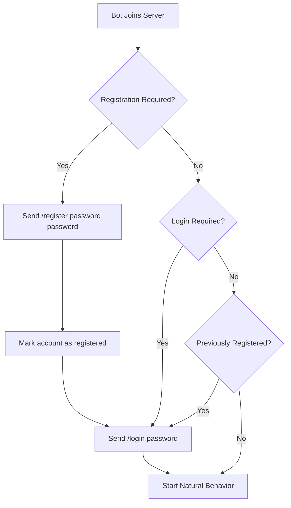

# 🤖 MC AFK Bot

[](https://nodejs.org/)
[](https://discord.com/)
[](LICENSE)
[](https://www.zendevelopment.in)

> A Minecraft AFK bot for cracked servers with AuthMe/NLogin support. Automatically registers new accounts, logs in returning ones, and rotates accounts when kicked — perfect for hosting providers with auto-kick bugs.

---

## 📋 Table of Contents

- [Features](#-features)
- [Prerequisites](#-prerequisites)
- [Installation](#-installation)
- [Configuration](#-configuration)
- [Authentication Flow](#-authentication-flow)
- [Discord Commands](#-discord-commands)
- [Natural Behavior](#-natural-behavior)
- [Account Rotation](#-account-rotation)
- [Troubleshooting](#-troubleshooting)
- [Contributing](#-contributing)
- [License](#-license)

---

## ✨ Features

- 🔐 **Smart Authentication** — Auto-registers new accounts and auto-logs returning ones
- 🎮 **Discord Control** — Full remote control via Discord bot
- 🔄 **Account Rotation** — Automatically switches accounts when kicked
- 🤖 **Natural Behavior** — Mimics human-like movements to avoid detection
- 📊 **Account Tracking** — Tracks registration status, kick counts, and session times
- ⚙️ **Highly Configurable** — Easy setup via `.env` file

---

## 📦 Prerequisites

- [Node.js](https://nodejs.org/) (v18 or higher)
- [npm](https://www.npmjs.com/) (comes with Node.js)
- A Discord Bot Token ([Create one here](https://discord.com/developers/applications))
- Minecraft server IP and port

---

## 🚀 Installation

### 1. Clone the repository

```bash
git clone https://github.com/yourusername/mc-afk-bot.git
cd mc-afk-bot
```

2. Install dependencies

```bash
npm install
```

3. Configure environment

```bash
cp .env.example .env
```

Edit .env with your server details:

```env
# Minecraft Server
MC_HOST=play.yourserver.com
MC_PORT=25565
MC_VERSION=1.20.1

# Authentication
LOGIN_PASSWORD=BotPass123!   # Used for both /register AND /login

# Discord Bot
DISCORD_TOKEN=your_discord_bot_token
DISCORD_CHANNEL_ID=your_channel_id
DISCORD_PREFIX=!

# Account Management
AUTO_SWITCH_MINUTES=50       # Switch accounts before host kicks
RECONNECT_DELAY=5            # Seconds between reconnection attempts
```

4. Add bot usernames

Create usernames.txt with one username per line:

```txt
MyBot1
MyBot2
MyBot3
MyBot4
```

5. Start the bot

```bash
npm start
```

For development with auto-restart:

```bash
npm run dev
```

---

🔐 Authentication Flow

The bot intelligently handles authentication without manual intervention:



Supported Auth Plugins:

· ✅ AuthMe Reloaded
· ✅ NLogin
· ✅ CMI Auth
· ✅ FastLogin
· ✅ Most other /register + /login style plugins

Key Points:

· All accounts use the same password (set in LOGIN_PASSWORD)
· Registration state persists in registered_accounts.json
· Once registered, the bot auto-logs in on subsequent joins

---

💬 Discord Commands

Command Description Example
!start Connect bot to Minecraft server !start
!stop Disconnect and stop the bot !stop
!switch Manually switch to next account !switch
!status Show current account, stats, and info !status
!accounts List all accounts with kick/session counts !accounts
!say <msg> Send a chat message in-game !say Hello everyone!
!move <dir> Move the bot (forward/back/left/right/jump) !move forward
!chop Find and chop the nearest tree !chop
!pos Show bot's XYZ coordinates !pos
!health Show health and food levels !health
!help Show all available commands !help

---

🧠 Natural Behavior

To avoid detection as a bot, the AI performs random human-like actions every 8–25 seconds:

Behavior Weight Description
🚶 Random Walk High Walks up to 8 blocks in a random direction
👀 Look Around High Head turns 1-3 times
🦘 Jump Medium Random jumping (sometimes with forward movement)
🤫 Sneak Medium Sneaks for 1-3.5 seconds
💪 Swing Arm Medium Random arm swing animation
🎒 Open Inventory Low Opens and closes inventory
😴 Stand Idle Low Does nothing for a moment

---

🔄 Account Rotation Flow

The bot automatically rotates accounts to prevent disconnection issues:

```
┌─────────────────────────────────────────────────────────┐
│  1. Account joins server                              │
│  2. Auto-register if new / Auto-login if returning   │
│  3. Behaves naturally                                │
└─────────────────────────────────────────────────────────┘
                        │
                        ▼
    ┌──────────────────────────────────────────────┐
    │  Trigger Event:                             │
    │  • Host kicks (server bug)                  │
    │  • AUTO_SWITCH_MINUTES elapsed              │
    │  • Manual !switch command                   │
    └──────────────────────────────────────────────┘
                        │
                        ▼
┌─────────────────────────────────────────────────────────┐
│  4. Switch to next account in usernames.txt           │
│  5. If registered → /login only                       │
│  6. If new → /register then /login                    │
│  7. Repeat flow                                       │
└─────────────────────────────────────────────────────────┘
```

---

🔧 Troubleshooting

❌ Bot not registering/logging in

· Check console output — it prints every auth step
· Verify LOGIN_PASSWORD in .env matches your server's requirements
· Delete registered_accounts.json to force re-registration of all accounts
· Ensure the server uses supported auth plugins

❌ Wrong Minecraft version

· Update MC_VERSION in .env to match your server
· Common values: 1.19.4, 1.18.2, 1.20.1

❌ Discord bot not responding

· Enable Message Content Intent in Discord Developer Portal → Your App → Bot
· Verify DISCORD_CHANNEL_ID points to the correct channel
· Check the bot has proper permissions in the channel

❌ Bot gets stuck after joining

· Monitor console for the exact chat messages the server sends
· The auth trigger list covers most plugins, but you can add custom triggers in src/mcBot.js

❌ Bot disconnects frequently

· Increase RECONNECT_DELAY in .env
· Check if AUTO_SWITCH_MINUTES is set too high or too low
· Verify your internet connection stability

---

📁 Project Structure

```
mc-afk-bot/
├── index.js                  # Main entry point
├── usernames.txt             # Bot usernames (one per line)
├── registered_accounts.json  # Auto-created: tracks registered accounts
├── .env                      # Configuration (copy from .env.example)
├── package.json              # Dependencies and scripts
└── src/
    ├── mcBot.js              # Minecraft bot + auth handler + behavior
    ├── discordBot.js         # Discord commands and controls
    ├── accountManager.js     # Account rotation logic
    └── logger.js             # Console logging utility
```

---

🤝 Contributing

Contributions are welcome! Here's how you can help:

1. Fork the repository
2. Create a feature branch (git checkout -b feature/AmazingFeature)
3. Commit your changes (git commit -m 'Add some AmazingFeature')
4. Push to the branch (git push origin feature/AmazingFeature)
5. Open a Pull Request

Please ensure your code follows the existing style and includes appropriate comments.

---

📄 License

Distributed under the MIT License. See LICENSE for more information.

---

🌐 Visit Us

www.zendevelopment.in — Explore more projects and services from Zen Development.

---

⚠️ Disclaimer

This bot is intended for educational and legitimate AFK purposes only. Please ensure you have permission to use bots on the server you're connecting to, and comply with the server's rules and terms of service. The authors are not responsible for any misuse or violations of server policies.

---

📞 Support

· Issues: GitHub Issues
· Discord: Join our Discord Server
· Documentation: Check the Wiki
· Website: www.zendevelopment.in

---

Made with ❤️ by Zen Development for the Minecraft community

```
